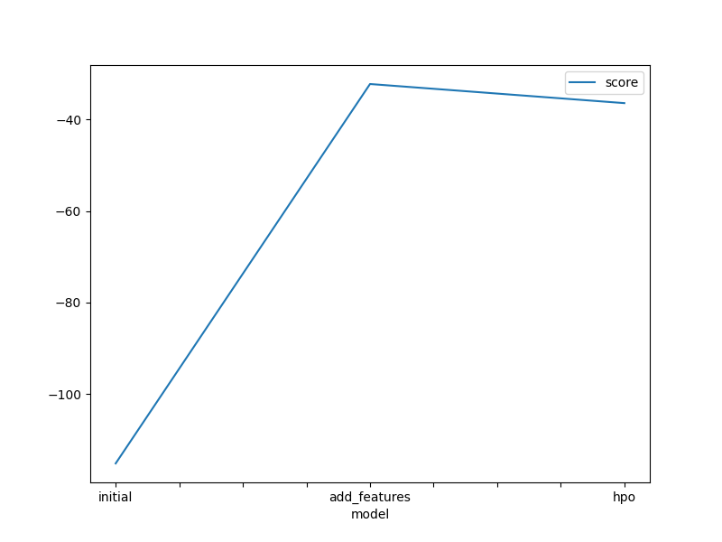
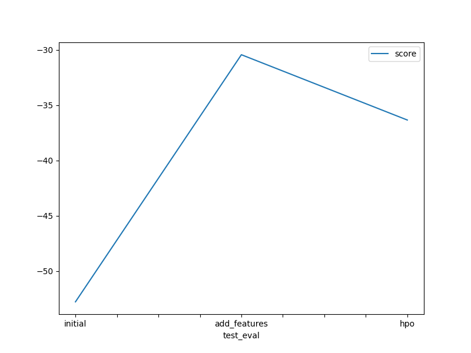

# Report: Predict Bike Sharing Demand with AutoGluon Solution
#### Ayodeji Adesegun

## Initial Training
### What did you realize when you tried to submit your predictions? What changes were needed to the output of the predictor to submit your results?
I noticed that Kaggle doesn't accept negative values, and had to eliminate them.
### What was the top ranked model that performed?
The top ranked model was WeightedEnsemble_L3 with the score -52.878367.

## Exploratory data analysis and feature creation
### What did the exploratory analysis find and how did you add additional features?
Exploratory Data Analysis was carried out by visualising the distribution of all attributes using a histogram. I discovered that if I could extract additional information about the hour, day, and month, the datetime features would be more useful. By utilising these additional features, I will be able to supply more specific information to my model, allowing it to learn more effectively.

### How much better did your model preform after adding additional features and why do you think that is?
The initial RMSE score for the first model was -52.785675. With the inclusion of the features, the model's performance increased to -30.438726.

## Hyper parameter tuning
### How much better did your model preform after trying different hyper parameters?
It had a better score of .

### If you were given more time with this dataset, where do you think you would spend more time?
I would go further into the data and perform feature engineering to create new features that would better inform the model, as well as try more hyperparameter tuning.

### Create a table with the models you ran, the hyperparameters modified, and the kaggle score.
|model|num_bag_sets|presets|time_limit|score|
|--|--|--|--|--|
|initial|None|best_quality|600|1.8007|
|add_features|None|best_quality|600|0.63507|
|hpo|1|best_quality|900|0.468|

### Create a line plot showing the top model score for the three (or more) training runs during the project.

TODO: Replace the image below with your own.

### Create a line plot showing the top kaggle score for the three (or more) prediction submissions during the project.

TODO: Replace the image below with your own.

## Summary
The project did well with a total score 0f 0.468.